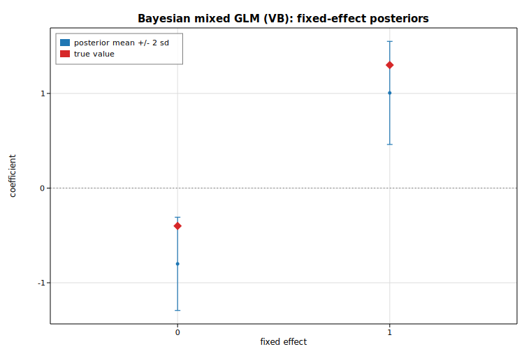

# Bayesian mixed GLM (variational Bayes)

A Bayesian generalized linear *mixed* model adds Gaussian random effects to a
GLM. Here we fit a binomial (logit-link) model with a per-group random
intercept,

```text
logit P(yᵢ = 1) = b₀ + b₁ xᵢ + u_group(i),   u_g ~ N(0, σ_u²),
```

using [`BayesMixedGlm::fit_vb`](https://docs.rs/solow-bayes), which maximizes the
evidence lower bound (ELBO) of a mean-field Gaussian variational posterior. This
is **deterministic variational Bayes, not MCMC**: the fit returns a posterior
*mean* and posterior *standard deviation* for every parameter (an approximate
Gaussian posterior), so we summarize the fixed effects as point estimates with
±2 posterior-sd credible bands rather than drawing samples.

The data is synthesized from the generative model above with the gallery's
deterministic SplitMix64 RNG (8 groups × 12 observations = 96 rows), so the run
is fully reproducible.

## Code

```rust
use ndarray::{Array1, Array2};
use solow_bayes::{BayesMixedGlm, Family};
use solow_viz::{Color, Figure, LegendLoc, LineStyle};

// Generative model: logit P(y=1) = -0.4 + 1.3 x + u_g,  u_g ~ N(0, 0.8²).
let (n_groups, per) = (8usize, 12usize);
let n = n_groups * per;
let (true_b0, true_b1, true_sigma_u) = (-0.4_f64, 1.3, 0.8);

let mut rng = common::Rng::new(20240618);
let group_u: Vec<f64> = (0..n_groups).map(|_| true_sigma_u * rng.normal()).collect();

// Fixed-effects design [1, x]; random-effects design = one indicator column
// per group (a random intercept). `ident` ties every group column to a single
// variance component (one shared log-sd parameter).
let mut exog = Array2::<f64>::zeros((n, 2));
let mut exog_vc = Array2::<f64>::zeros((n, n_groups));
let mut endog = Array1::<f64>::zeros(n);
for i in 0..n {
    let g = i / per;
    let xi = -1.5 + 3.0 * (i % per) as f64 / (per as f64 - 1.0);
    let eta = true_b0 + true_b1 * xi + group_u[g];
    let p = 1.0 / (1.0 + (-eta).exp());
    exog[[i, 0]] = 1.0;
    exog[[i, 1]] = xi;
    exog_vc[[i, g]] = 1.0;
    endog[i] = rng.bernoulli(p);
}
let ident = vec![0usize; n_groups];

// Fit by variational Bayes. vcp_p / fe_p are the prior sds for the
// variance-component log-sd and the fixed effects.
let model =
    BayesMixedGlm::new(Family::Binomial, endog, exog, exog_vc, ident, 1.0, 4.0).unwrap();
let res = model.fit_vb(None, None, 100_000, 1e-6).unwrap();

// res.fe_mean / res.fe_sd  -> fixed-effect posterior mean & sd
// res.vcp_mean             -> log-sd of the random intercept (exp -> sigma_u)
// res.vc_mean / res.vc_sd  -> per-group random-intercept posteriors
// res.elbo                 -> maximized ELBO (the variational log-likelihood)
```

The fixed-effect posteriors are then plotted as points with ±2 posterior-sd
credible bands, with the data-generating truth marked for reference:

```rust
let xs = [0.0_f64, 1.0];
let means = [res.fe_mean[0], res.fe_mean[1]];
let err2 = [2.0 * res.fe_sd[0], 2.0 * res.fe_sd[1]];
let truth = [true_b0, true_b1];

let mut fig = Figure::new(760, 520);
let ax = fig.axes();
ax.set_title("Bayesian mixed GLM (VB): fixed-effect posteriors")
    .set_xlabel("fixed effect").set_ylabel("coefficient").set_grid(true);
ax.set_xlim(-0.6, 1.6);
ax.axhline(0.0, Color::GRAY, LineStyle::Dotted);
ax.errorbar(&xs, &means, &err2, Color::cycle(0), Some("posterior mean +/- 2 sd"));
ax.scatter_full(&xs, &truth, Color::RED, 6.0, solow_viz::Marker::Diamond, 1.0, Some("true value"));
ax.legend(LegendLoc::UpperLeft);
fig.save_svg("bayes_posterior.svg").unwrap();
```

## Printed results

```text
Bayesian mixed GLM (binomial / logit) by variational Bayes
  observations: 96   groups: 8   per group: 12
  converged: true   iters: 23   |grad|: 2.764e-7   ELBO: -63.481683

Fixed effects (approximate Gaussian posterior):
  name               post. mean     post. sd    post. mean +/- 2 sd
  intercept (b0)       -0.80040      0.24613   -1.29267 .. -0.30814
  slope (b1)            1.00540      0.27225    0.46090 ..  1.54991

Variance component (group random intercept, log-sd):
  vcp posterior mean: -0.02104   posterior sd: 0.24284
  implied sigma_u = exp(vcp_mean): 0.97918   (true 0.800)

Random intercept posterior means by group (vc_mean):
  group  0: post. mean  0.24616  post. sd 0.53770  (true u  0.48418)
  group  1: post. mean -1.05301  post. sd 0.60813  (true u -1.18688)
  group  2: post. mean -0.36203  post. sd 0.56185  (true u -0.80476)
  group  3: post. mean -0.36203  post. sd 0.56185  (true u -0.83760)
  group  4: post. mean -0.36203  post. sd 0.56185  (true u -1.28414)
  group  5: post. mean  0.81912  post. sd 0.53053  (true u  0.23701)
  group  6: post. mean  1.39322  post. sd 0.53873  (true u  0.90634)
  group  7: post. mean -0.36203  post. sd 0.56185  (true u -1.05832)
```

The 95%-style credible band for the slope (`0.461 … 1.550`) comfortably covers
the true `1.3`, and the band for the intercept (`-1.293 … -0.308`) covers the
true `-0.4`; with only 96 binary observations the variational posterior is
appropriately wide. The recovered group-intercept sd, `exp(vcp_mean) ≈ 0.979`,
is in the right neighborhood of the true `0.8` (a single small sample identifies
a scale parameter only loosely).

Two honest caveats worth noting. First, several groups (2, 3, 4, 7) land on the
*identical* posterior mean `-0.36203`: with the same within-group `x` grid these
groups happened to draw the same 0/1 outcome pattern, so they share sufficient
statistics and the posterior cannot distinguish them — the random-effect means
shrink them all toward the common value. Second, variational Bayes is known to
*understate* posterior uncertainty relative to full MCMC, so these bands should
be read as the variational approximation's credible intervals, not as exact
posterior intervals.

## Plot


