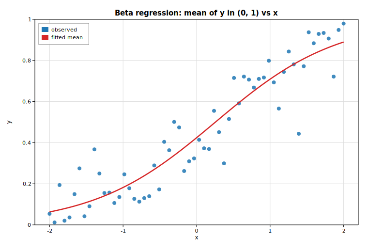

# Beta regression

Beta regression models a response that lives strictly in the open interval
`(0, 1)` — a rate, proportion, or fraction. The conditional mean `μ` is linked to
a linear predictor (by default the logit link, `logit(μ) = β₀ + β₁x`), and the
response is taken to be Beta-distributed with that mean and a separate precision
`φ > 0`. This example fits a
[`BetaModel`](https://docs.rs/solow-othermod) by maximum likelihood to
deterministic synthetic data, prints the recovered coefficients, and overlays
the fitted mean curve `μ̂(x) = logistic(β̂₀ + β̂₁x)` on the scatter.

## Code

```rust
use ndarray::{Array1, Array2};
use solow_othermod::BetaModel;
use solow_viz::{Color, Figure, LegendLoc, LineStyle, Marker};

fn logistic(eta: f64) -> f64 {
    1.0 / (1.0 + (-eta).exp())
}

// Mean submodel: logit(μ_i) = b0 + b1 * x_i with true (b0, b1) = (-0.4, 1.3),
// and a fixed Beta precision φ = 18. Responses are perturbed on the logit
// scale so every y stays strictly inside (0, 1). x ranges over [-2, 2].
let n = 60usize;
let x_raw: Vec<f64> = (0..n).map(|i| -2.0 + 4.0 * (i as f64) / (n as f64 - 1.0)).collect();
// y_vec is built from x_raw plus deterministic pseudo-random logit-scale noise.

// Mean design: intercept + x. Precision design: intercept only.
let mut exog = Array2::<f64>::ones((n, 2));
for i in 0..n {
    exog[[i, 1]] = x_raw[i];
}
let exog_precision = Array2::<f64>::ones((n, 1));
let y = Array1::from(y_vec.clone());

// Fit by maximum likelihood (logit mean link, log precision link).
let res = BetaModel::new(y, exog, exog_precision).unwrap().fit().unwrap();

let beta = res.params_mean();
let gamma = res.params_precision();
let phi_hat = gamma[0].exp(); // log precision link => φ = exp(γ₀)
```

The fitted mean curve is then traced over the covariate range and drawn over the
scatter:

```rust
let m = 200usize;
let xs_curve: Vec<f64> = (0..m).map(|i| -2.0 + 4.0 * (i as f64) / (m as f64 - 1.0)).collect();
let ys_curve: Vec<f64> = xs_curve.iter().map(|&xv| logistic(beta[0] + beta[1] * xv)).collect();

let mut fig = Figure::new(760, 520);
let ax = fig.axes();
ax.set_title("Beta regression: mean of y in (0, 1) vs x")
    .set_xlabel("x").set_ylabel("y").set_grid(true);
ax.set_ylim(0.0, 1.0);
ax.scatter_full(&x_raw, &y_vec, Color::cycle(0), 4.0, Marker::Circle, 0.85, Some("observed"));
ax.line(&xs_curve, &ys_curve, Color::RED, 2.5, LineStyle::Solid, Marker::None, 1.0, Some("fitted mean"));
ax.legend(LegendLoc::UpperLeft);
fig.save_svg("beta_reg.svg").unwrap();
```

## Printed results

```text
Beta regression (logit mean link, log precision link)
  converged      : true
  nobs           : 60
  log-likelihood : 59.2226

  mean coefficients (β)        coef     std err          z       P>|z|
  const           -0.3059       0.0745      -4.1078      0.0000
  x                1.1971       0.0746      16.0431      0.0000
  precision coefficient (γ)    coef     std err          z       P>|z|
  log(phi)         2.7745       0.1807      15.3506      0.0000

  implied precision  phi = exp(gamma0) = 16.0300
  recovered mean model: logit(mu) = -0.3059 + 1.1971 x   (true: -0.4000 + 1.3000 x)
```

The maximum-likelihood fit converges and recovers the mean model closely: the
slope estimate `1.197` and intercept `-0.306` are near the true `1.3` and `-0.4`,
and the implied precision `φ̂ = exp(γ̂₀) = 16.03` is close to the true `18`. Both
mean coefficients are strongly significant.

## Plot


