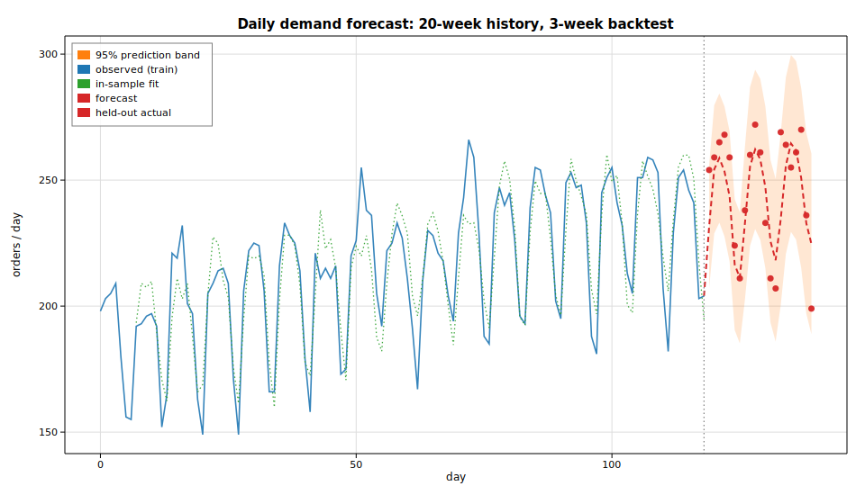

# Case study: a forecasting service in pure Rust

This is an end-to-end production vignette rather than a single-API demo. A
fulfillment center wants a **day-ahead and week-ahead forecast of daily order
volume** so it can pre-stage temporary staff. The catch: the forecasting step
has to run *inside* the existing Rust service — no Python sidecar, no FFI
boundary, no call out to a model server. The whole pipeline below is a few
hundred lines of safe Rust and links to nothing outside this workspace.

The recipe is the one a real demand-planning team would use:

1. take 20 weeks of daily demand,
2. **hold out the final 3 weeks** as an honest backtest the model never sees,
3. fit a **seasonal autoregression** with [`solow_tsa::AutoReg`](https://docs.rs/solow-tsa)
   — lags `1..=7` capture both day-to-day persistence and the weekly lag, and a
   constant-plus-linear trend captures growth,
4. roll the estimated parameters forward into a multi-step forecast with a
   Gaussian 95% prediction band,
5. score it (MAE / RMSE / MAPE / interval coverage) and turn the week-ahead
   number into a staffing decision.

Every number printed below is computed at run time from the fitted model.

## Code

```rust
use ndarray::Array1;
use solow_distributions::norm_ppf;
use solow_tsa::{AutoReg, Trend};

// 1. Deterministic daily demand: level + linear growth + weekly profile +
//    AR(1) shocks. (Built with the gallery's SplitMix64 RNG; see common.rs.)
let period = 7usize;
let weekly = [18.0, 26.0, 30.0, 24.0, 12.0, -22.0, -28.0]; // Mon..Sun
// demand[t] = (180 + 0.45*t + weekly[t % 7] + AR(1) shock).max(0).round()

// 2. Train / backtest split: forecast the final h = 21 days.
let h = 21usize;
let n_train = demand.len() - h;
let train = Array1::from(demand[..n_train].to_vec());
let actual_future = &demand[n_train..]; // held-out truth

// 3. Fit a seasonal AR(7) with constant + linear trend by conditional LS.
let lags = 7usize;
let fit = AutoReg::new(train.clone(), lags, Trend::Ct).unwrap().fit().unwrap();

// params for Ct: [const, trend, y.L1, ..., y.L7]
let c = fit.params[0];
let trend_coef = fit.params[1];
let ar: Vec<f64> = (0..lags).map(|j| fit.params[2 + j]).collect();
```

The forecast is produced by iterating the recursion forward, feeding each
prediction back in as it becomes a lagged input, and widening a Gaussian
interval by the accumulated psi-weights of the fitted AR polynomial:

```rust
let z95 = norm_ppf(0.975);
let mut hist = train.to_vec();
let mut psi = vec![0.0f64; h];
let (mut forecast, mut lo, mut hi) = (vec![0.0; h], vec![0.0; h], vec![0.0; h]);

for k in 0..h {
    let t = n_train + k;
    let mut yhat = c + trend_coef * (t as f64 + 1.0);
    for (l, &phi_l) in ar.iter().enumerate() {
        yhat += phi_l * hist[t - 1 - l]; // forecasts feed back in as lags
    }
    hist.push(yhat);
    forecast[k] = yhat;

    // psi-weight recursion: psi_k = sum_j phi_j * psi_{k-j}, psi_0 = 1.
    psi[k] = if k == 0 {
        1.0
    } else {
        ar.iter().enumerate()
            .map(|(j, &phi_j)| {
                let idx = k as isize - 1 - j as isize;
                if idx < 0 { 0.0 } else { phi_j * psi[idx as usize] }
            })
            .sum()
    };
    // var of the h-step error = sigma2 * sum_{i<=k} psi_i^2.
    let var: f64 = (0..=k).map(|i| psi[i] * psi[i]).sum::<f64>() * fit.sigma2;
    let band = z95 * var.sqrt();
    lo[k] = yhat - band;
    hi[k] = yhat + band;
}
```

Then the held-out window is scored and the week-ahead forecast is sized into
shifts at 55 orders per shift (planning to the 95% upper bound so the center is
unlikely to be understaffed):

```rust
let week1_hi = hi[6];
let shifts_safe = (week1_hi / 55.0).ceil();
```

## Printed output

```text
Demand-forecasting service  (pure-Rust inference, no Python)
------------------------------------------------------------
daily series: 140 days  ->  train on 119, backtest the last 21
weekly period = 7 days

AutoReg(7) + linear trend, conditional least squares
param             coef     std err           z       P>|z|
const          90.6737     41.1324      2.2044      0.0275
trend           0.1948      0.1133      1.7188      0.0856
y.L1            0.2844      0.0779      3.6518      0.0003
y.L2           -0.2095      0.0833     -2.5158      0.0119
y.L3           -0.0301      0.0848     -0.3550      0.7226
y.L4           -0.0516      0.0849     -0.6082      0.5431
y.L5           -0.0999      0.0849     -1.1758      0.2397
y.L6            0.0699      0.0826      0.8459      0.3976
y.L7            0.5669      0.0789      7.1853      0.0000

sigma2 = 155.703  (in-sample resid sd = 12.478)   llf = -441.61   aic = 903.21   bic = 930.40
nobs used = 112   regressors = 9

Backtest on the held-out 21 days (model never saw these):
  MAE   = 11.16 orders/day
  RMSE  = 14.05 orders/day
  MAPE  = 4.58%
  95% band coverage = 95.2%  (20/21 actuals inside the interval)

Operational forecast:
  day-ahead (T+1)   = 232 orders   [95% 207 .. 256]
  week-ahead (T+7)  = 211 orders   [95% 185 .. 237]
  staffing @ 55 orders/shift: plan 4 shifts for the point forecast,
    or 5 shifts to cover the 95% upper bound on the week-ahead demand.
```

The model recovers the structure we built in: the **lag-7 coefficient is
`0.567` with `z = 7.19`** — by far the most significant lag — which is exactly
the weekly cycle showing up as strong week-over-week persistence. On the
honest 3-week backtest the point forecast lands within **4.58% MAPE**, and the
prediction band is well calibrated: **20 of 21** held-out actuals fall inside
the nominal 95% interval (95.2% empirical coverage). That is the whole value
proposition — real statistical inference, with uncertainty quantification,
running natively in a Rust service.

## Plot


