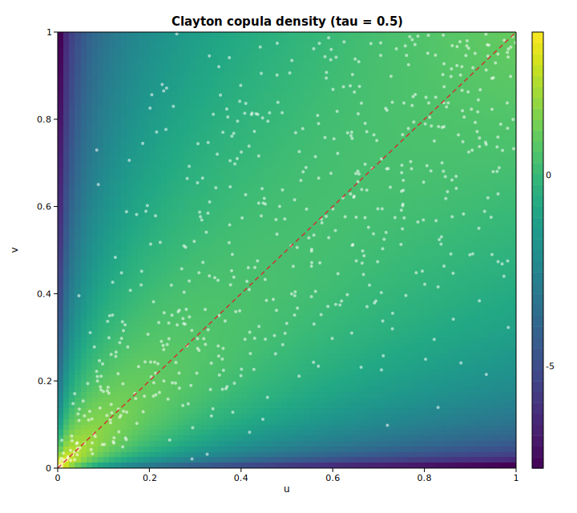

# Copula dependence (Clayton)

A copula strips a joint distribution down to its dependence structure: it is the
joint law on uniform margins, so all of its content is *how* the coordinates
move together, not where each one lives. The **Clayton** family models
lower-tail dependence — small values of one coordinate strongly pull the other
down, while the upper tail is comparatively loose.

This example pins the dependence parameter `theta` from a target Kendall's tau
with [`ClaytonCopula::theta_from_tau`](https://docs.rs/solow-copula), evaluates
the closed-form copula density `c(u, v)` on a grid over the unit square, draws a
deterministic pseudo-random sample by conditional inversion, and recovers the
rank correlations from that sample with
[`kendalls_tau`](https://docs.rs/solow-copula) and
[`spearmans_rho`](https://docs.rs/solow-copula).

## Code

```rust
use solow_copula::{kendalls_tau, spearmans_rho, ClaytonCopula};
use solow_viz::{Color, Colormap, Figure, LineStyle, Marker};

// Pin theta from a target Kendall's tau: tau = theta / (theta + 2).
let target_tau = 0.5;
let theta = ClaytonCopula::theta_from_tau(target_tau);
let cop = ClaytonCopula::new(theta);

// Evaluate the copula density on an n x n grid over the unit square. Row 0 is
// drawn at the TOP of the extent, so v runs from high to low as the row grows.
// The log-density compresses the (0, 0) corner spike into a readable range.
let n = 80usize;
let eps = 1.0 / (n as f64 + 1.0);
let coord = |k: usize| eps + (1.0 - 2.0 * eps) * (k as f64) / ((n - 1) as f64);
let mut grid: Vec<Vec<f64>> = Vec::with_capacity(n);
for r in 0..n {
    let v = coord(n - 1 - r);
    grid.push((0..n).map(|c| cop.pdf(coord(c), v).ln()).collect());
}

// Draw a reproducible sample by conditional inversion (deterministic RNG).
// v = ( u^{-theta} (w^{-theta/(1+theta)} - 1) + 1 )^{-1/theta}, u, w ~ Unif.
let mut rng = common::Rng::new(0xC0FFEE_u64);
let (mut us, mut vs) = (Vec::new(), Vec::new());
for _ in 0..600 {
    let u = rng.uniform().clamp(1e-9, 1.0 - 1e-9);
    let w = rng.uniform().clamp(1e-9, 1.0 - 1e-9);
    let a = w.powf(-theta / (1.0 + theta)) - 1.0;
    let v = (u.powf(-theta) * a + 1.0).powf(-1.0 / theta);
    us.push(u);
    vs.push(v.clamp(1e-9, 1.0 - 1e-9));
}

println!("  sample Kendall's tau : {:.4}  (analytic {:.4})",
         kendalls_tau(&us, &vs), cop.tau());
```

The density grid is rendered as a heatmap with the sample scattered on top and
the `u = v` diagonal — where Clayton concentrates its mass — drawn as a guide:

```rust
let mut fig = Figure::new(720, 640);
let ax = fig.axes();
ax.set_title("Clayton copula density (tau = 0.5)").set_xlabel("u").set_ylabel("v");
ax.heatmap(&grid, Colormap::Viridis, (0.0, 1.0, 0.0, 1.0), true);
ax.scatter_full(&us, &vs, Color::WHITE, 2.0, Marker::Circle, 0.55, Some("sample"));
ax.line(&[0.0, 1.0], &[0.0, 1.0], Color::RED, 1.5, LineStyle::Dashed,
        Marker::None, 0.9, Some("u = v"));
ax.set_xlim(0.0, 1.0).set_ylim(0.0, 1.0);
fig.save_svg("copula_density.svg").unwrap();
```

## Printed output

```text
Clayton copula
  target Kendall's tau : 0.5000
  implied theta        : 2.000000
  analytic tau(theta)  : 0.500000
  density landmarks c(u, v):
    c(0.1, 0.1) = 5.3702
    c(0.5, 0.5) = 1.4810
    c(0.9, 0.9) = 2.1578
    c(0.1, 0.9) = 0.0409
  grid: 80 x 80 over (u, v) in (0.0123, 0.9877)
  log-density range    : [-7.6530, 3.7604]
  sample size          : 600
  sample Kendall's tau : 0.4901  (analytic 0.5000)
  sample Spearman rho  : 0.6694
```

A target Kendall's tau of `0.5` implies `theta = 2`, and the analytic
`tau(theta)` recovers `0.5` exactly. The density landmarks tell the lower-tail
story directly: `c(0.1, 0.1) = 5.37` is far heavier than the symmetric upper
corner `c(0.9, 0.9) = 2.16`, while the off-diagonal `c(0.1, 0.9) = 0.04` is
nearly empty. The 600-point sample, drawn with the deterministic SplitMix64
generator, recovers a Kendall's tau of `0.4901` — within sampling error of the
analytic `0.5`.

## Plot


