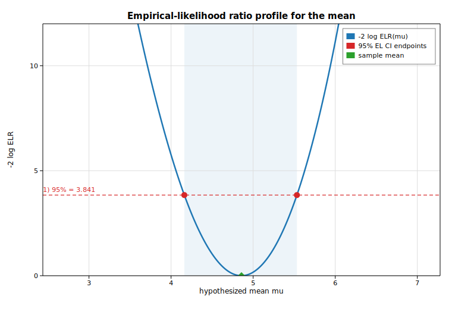

# Empirical-likelihood ratio for the mean

Empirical likelihood (EL) turns the nonparametric likelihood of a sample into a
profile statistic. For a hypothesized mean `mu`, the EL-ratio statistic
`-2 log ELR(mu)` measures how strongly the data contradict that value; it is
asymptotically chi-squared with one degree of freedom. This example draws a
small reproducible sample, sweeps a grid of hypothesized means with
[`DescStat::test_mean`](https://docs.rs/solow-emplike), and plots the profile
curve against the chi-squared(1) 95% critical value. The two points where the
profile crosses that threshold are the 95% EL confidence interval — which we
cross-check against [`DescStat::ci_mean`](https://docs.rs/solow-emplike).

## Code

```rust
use solow_emplike::DescStat;
use solow_viz::{Color, Figure, LegendLoc, LineStyle, Marker};

// Example data: 30 draws from N(5, 2^2) with deterministic pseudo-random noise.
let n = 30usize;
// `data` is built from a seeded SplitMix64 stream, so the run is reproducible.
let sample_mean = data.iter().sum::<f64>() / n as f64;

let d = DescStat::new(&data);

// 95% EL confidence interval for the mean, from the gamma root-finder.
let (ci_lo, ci_hi) = d.ci_mean(0.05);
let crit = 3.841_458_820_694_124_f64; // chi2_ppf(0.95, 1)

// Profile -2 logELR over a grid of hypothesized means.
let (grid_lo, grid_hi) = (sample_mean - 2.2, sample_mean + 2.2);
let steps = 221usize;
let mut mus = Vec::with_capacity(steps);
let mut stats = Vec::with_capacity(steps);
for k in 0..steps {
    let mu = grid_lo + (grid_hi - grid_lo) * (k as f64) / (steps as f64 - 1.0);
    mus.push(mu);
    stats.push(d.test_mean(mu).stat);
}
```

The profile curve is then drawn with the threshold line and the EL confidence
band:

```rust
let mut fig = Figure::new(760, 520);
let ax = fig.axes();
ax.set_title("Empirical-likelihood ratio profile for the mean")
    .set_xlabel("hypothesized mean  mu")
    .set_ylabel("-2 log ELR")
    .set_grid(true);

ax.axvspan(ci_lo, ci_hi, Color::BLUE, 0.08); // shade the 95% EL CI
ax.line(&mus, &stats, Color::cycle(0), 2.5, LineStyle::Solid, Marker::None, 1.0,
        Some("-2 log ELR(mu)"));
ax.axhline(crit, Color::RED, LineStyle::Dashed); // chi2(1) 95% threshold
ax.scatter_full(&[ci_lo, ci_hi], &[crit, crit], Color::RED, 5.0, Marker::Circle,
                1.0, Some("95% EL CI endpoints"));
ax.set_ylim(0.0, 12.0);
ax.legend(LegendLoc::UpperRight);
fig.save_svg("emplike_ratio.svg").unwrap();
```

## Printed results

```text
Empirical-likelihood ratio for the mean
========================================
nobs              : 30
sample mean       : 4.857548

-2 logELR at sample mean : 0.000000  (p = 1.000000)
-2 logELR at true mean 5 : 0.168374  (p = 0.681561)

chi2(1) 95% threshold    : 3.841459
95% EL CI (ci_mean)      : [4.161524, 5.533040]
-2 logELR at CI endpoints: 3.841459, 3.841459  (should equal threshold)
```

The statistic vanishes at the sample mean (`4.858`), as it must, and the true
mean `5` is comfortably inside the interval (`p = 0.68`). The crucial
cross-check: evaluating `-2 log ELR` at the two `ci_mean` endpoints returns
exactly the chi-squared(1) threshold `3.841459`, confirming that the curve's
crossings and the closed-form interval `[4.162, 5.533]` agree.

## Plot


