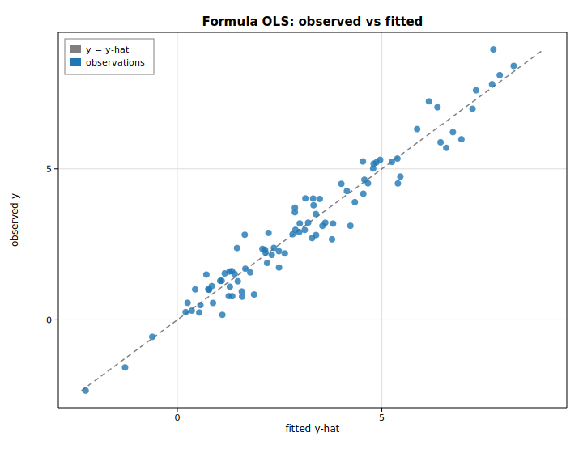

# The formula interface

The formula API (`solow-fit`) is the one-call bridge from an R/patsy-style
formula string plus a named `DataFrame` to a fully fitted model whose
coefficients are already **labeled** with the design-matrix column names. It is
the from-scratch equivalent of the reference library's `from_formula`
constructors: no hand-assembled design matrix, no manually threaded column
names.

This example fits

```text
y ~ x1 + x2 + C(group)
```

mixing two numeric predictors with a three-level categorical factor (expanded
into treatment-coded dummy columns), then shows that a Poisson GLM is just as
easy to fit from a formula.

## Code

```rust
use solow_fit::{ols, poisson, DataFrame};

let mut df = DataFrame::new();
df.add_numeric("y", y);
df.add_numeric("x1", x1);
df.add_numeric("x2", x2);
df.add_categorical("group", g);          // levels "A", "B", "C"

// Fit OLS straight from the formula; coefficients come back labeled.
let fit = ols("y ~ x1 + x2 + C(group)", &df).unwrap();
println!("Design columns: {:?}", fit.names());
println!("{}", fit.summary());

// The same ergonomics for a Poisson GLM.
let pfit = poisson("count ~ x1", &dfp).unwrap();
println!("{}", pfit.summary());
```

`C(group)` expands to two treatment-coded dummies (`[T.B]`, `[T.C]`) relative to
the reference level `A`, and the intercept is added automatically.

## Printed summary

```text
OLS from formula: y ~ x1 + x2 + C(group)
Design columns: ["Intercept", "C(group)[T.B]", "C(group)[T.C]", "x1", "x2"]

      Regression Results
==============================
Statistic                Value
------------------------------
Model:                     OLS
No. Observations:           90
Df Model:                    4
Df Residuals:               85
R-squared:               0.947
Adj. R-squared:          0.944
F-statistic:             379.1
Prob (F-statistic):  2.670e-53
Log-Likelihood:        -69.957
AIC:                    149.91
BIC:                    162.41
==============================

==============================================================
                 coef  std err        t  P>|t|  [0.025  0.975]
--------------------------------------------------------------
Intercept      0.7385   0.1335    5.532  0.000   0.473   1.004
C(group)[T.B]   2.663   0.1412   18.856  0.000   2.382   2.943
C(group)[T.C]  -1.451   0.1399  -10.371  0.000  -1.730  -1.173
x1             0.8635  0.03877   22.272  0.000   0.786   0.941
x2             -1.222  0.05772  -21.171  0.000  -1.337  -1.107
==============================================================
```

The estimated coefficients recover the true generating values: slopes of
`+0.8` on `x1` and `−1.2` on `x2`, and group offsets of `+2.5` (B) and `−1.5`
(C) relative to A. The Poisson model fit from `count ~ x1` is printed below it
in the program's output.

## Plot

Observed response against the formula model's fitted values, with the `y = ŷ`
reference diagonal — points hug the line because the model explains ~95% of the
variance.


