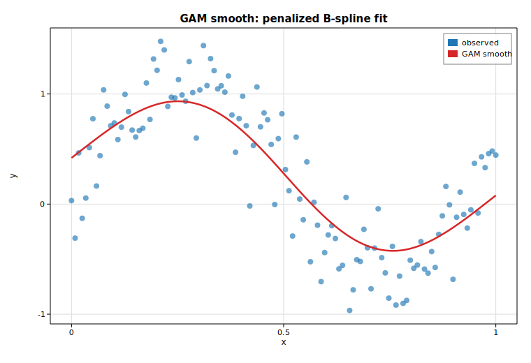

# Generalized additive models (smooth fit)

A generalized additive model replaces the linear predictor of a GLM with a sum
of smooth functions of the covariates. This example fits a Gaussian GAM with a
single penalized B-spline smooth term to a noisy nonlinear signal using
[`GlmGam`](https://docs.rs/solow-gam). The smooth is estimated by penalized
iteratively reweighted least squares (P-IRLS) at a fixed smoothing parameter
`alpha`; the curvature penalty trades wiggliness against fit, and the resulting
*effective degrees of freedom* measure how flexible the fitted curve is.

The true signal is `f(x) = sin(2πx) + 0.5x` corrupted by Gaussian noise. We fit
a cubic (`degree = 3`) B-spline basis with `df = 12` (which yields 11 basis
columns once the constant column is dropped) and a light penalty, then overlay
the fitted smooth on the scatter.

## Code

```rust
use ndarray::Array1;
use solow_gam::GlmGam;
use solow_glm::Family;
use solow_viz::{Color, Figure, LegendLoc, LineStyle, Marker};

// Example data: x in [0, 1];  f(x) = sin(2 pi x) + 0.5 x;  y = f(x) + N(0, 0.25^2)
let n = 120usize;
let sigma = 0.25;
let x = Array1::linspace(0.0, 1.0, n);
let signal = x.mapv(|xi| (std::f64::consts::TAU * xi).sin() + 0.5 * xi);
// y is signal plus deterministic pseudo-random Gaussian noise.

// Fit a penalized B-spline GAM (Gaussian, canonical identity link).
let df = 12usize;
let degree = 3usize;
let alpha = 0.01;
let res = GlmGam::new(y.clone(), &x, df, degree, alpha, Family::Gaussian)
    .unwrap()
    .fit()
    .unwrap();

println!("intercept         : {:.6}", res.intercept());
println!("edf (total)       : {:.6}", res.edf_total);
println!("scale (sigma^2)   : {:.6}", res.scale);
println!("deviance          : {:.6}", res.deviance);
```

The fitted means (`res.fittedvalues`) are evaluated at the observations, so the
smooth curve is drawn directly through `x`:

```rust
let x_vec: Vec<f64> = x.to_vec();
let fit_vec: Vec<f64> = res.fittedvalues.to_vec();

let mut fig = Figure::new(760, 520);
let ax = fig.axes();
ax.set_title("GAM smooth: penalized B-spline fit")
    .set_xlabel("x").set_ylabel("y").set_grid(true);
ax.scatter_full(&x_vec, &y_vec, Color::cycle(0), 4.0, Marker::Circle, 0.65, Some("observed"));
ax.line(&x_vec, &fit_vec, Color::RED, 2.5, LineStyle::Solid, Marker::None, 1.0, Some("GAM smooth"));
ax.legend(LegendLoc::UpperRight);
fig.save_svg("gam_smooth.svg").unwrap();
```

## Printed results

```text
Generalized additive model (penalized B-spline smooth)
------------------------------------------------------
family            : Gaussian (identity link)
basis             : 11 cubic B-spline columns (df=12)
smoothing alpha   : 0.01
converged         : true (in 2 iters)
intercept         : 0.419307
edf (total)       : 4.095559
df_resid          : 115.904441
scale (sigma^2)   : 0.098754
deviance          : 11.446068
penalized deviance: 17.048607
resid. std (est)  : 0.314252   (true sigma = 0.25)
```

The fit uses about `4.1` effective degrees of freedom — far fewer than the 12
nominal basis dimensions — capturing the sinusoidal shape plus the gentle linear
trend without chasing the noise. The estimated residual standard deviation
(`0.314`) is close to the true `0.25`, the small excess reflecting the smooth's
slight bias where the penalty rounds off the peaks.

## Plot


