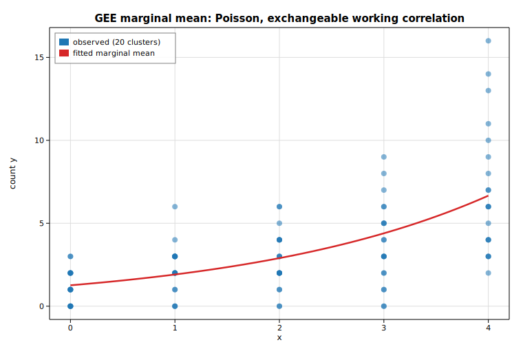

# Generalized estimating equations (GEE)

Generalized estimating equations fit a *population-averaged* (marginal) model
to clustered or longitudinal data. Instead of modelling each cluster's mean,
GEE targets the marginal mean `E[y] = g⁻¹(Xβ)` and treats the within-cluster
correlation as a *working* assumption — the point estimates stay consistent
even if that working correlation is wrong, and inference uses a cluster-robust
sandwich covariance.

This example builds 20 clusters of 5 observations each. Every cluster carries a
shared effect on the log scale, so the five counts inside a cluster are
genuinely positively correlated — exactly the structure an *exchangeable*
working correlation is meant to capture. We fit a marginal Poisson model
`log E[y] = β₀ + β₁x` with [`Gee`](https://docs.rs/solow-gee), print the real
fitted parameters and the estimated working correlation `α`, then overlay the
fitted marginal mean `μ(x) = exp(β₀ + β₁x)` on the observed counts.

## Code

```rust
use ndarray::{Array1, Array2};
use solow_gee::{CovStruct, Gee};
use solow_glm::Family;
use solow_viz::{Color, Figure, LegendLoc, LineStyle, Marker};

// 20 clusters of 5; marginal log-mean b0 + b1 x with a shared cluster effect
// (deterministic pseudo-random noise) that induces within-cluster correlation.
let n_clusters = 20usize;
let per_cluster = 5usize;
let (beta0, beta1) = (0.5, 0.30);

let mut x_raw: Vec<f64> = Vec::new();
let mut y_vec: Vec<f64> = Vec::new();
let mut group_labels: Vec<i64> = Vec::new();
for c in 0..n_clusters {
    let u = 0.40 * rng.normal();              // one shared effect per cluster
    for k in 0..per_cluster {
        let x = k as f64 * (4.0 / (per_cluster - 1) as f64);
        let mu = (beta0 + beta1 * x + u).exp();
        x_raw.push(x);
        y_vec.push(rng.poisson(mu));
        group_labels.push(c as i64);
    }
}
let n = x_raw.len();

// Design matrix [1, x].
let mut design = Array2::<f64>::zeros((n, 2));
for i in 0..n {
    design[[i, 0]] = 1.0;
    design[[i, 1]] = x_raw[i];
}
let y = Array1::from(y_vec.clone());

// Population-averaged Poisson GEE with an exchangeable working correlation.
let res = Gee::new(y, design, &group_labels, Family::Poisson, CovStruct::Exchangeable)
    .unwrap()
    .fit()
    .unwrap();

let (b0, b1) = (res.params[0], res.params[1]);
println!("working corr (alpha) : {:.6}", res.dep_params);
```

The fitted marginal mean `μ(x) = exp(β₀ + β₁x)` is drawn over the scatter of
observed counts:

```rust
let xs_line: Vec<f64> = (0..100).map(|i| 4.0 * i as f64 / 99.0).collect();
let ys_line: Vec<f64> = xs_line.iter().map(|&x| (b0 + b1 * x).exp()).collect();

let mut fig = Figure::new(760, 520);
let ax = fig.axes();
ax.set_title("GEE marginal mean: Poisson, exchangeable working correlation")
    .set_xlabel("x").set_ylabel("count y").set_grid(true);
ax.scatter_full(&x_raw, &y_vec, Color::cycle(0), 4.0, Marker::Circle, 0.55,
                Some("observed (20 clusters)"));
ax.line(&xs_line, &ys_line, Color::RED, 2.5, LineStyle::Solid, Marker::None, 1.0,
        Some("fitted marginal mean"));
ax.legend(LegendLoc::UpperLeft);
fig.save_svg("gee_marginal.svg").unwrap();
```

## Printed results

```text
Population-averaged GEE (Poisson, log link, exchangeable)
  observations         : 100
  clusters             : 20
  converged            : true
  score-equation norm  : 3.686e-12

  param        estimate     robust SE    naive SE       z
  const         0.230975     0.135871    0.143895    1.700
  x             0.416398     0.045468    0.039731    9.158

  working corr (alpha) : 0.204650
  scale                : 1.000000
  marginal mean        : log(mu) = 0.2310 + 0.4164 * x
```

The estimating equations are solved to a score-norm of `3.7e-12`. The
exchangeable working correlation recovers a clearly positive association
`α ≈ 0.205`, reflecting the shared cluster effect built into the data. Note how
the robust (sandwich) standard error for the slope (`0.0455`) exceeds the naive
model-based one (`0.0397`): ignoring the within-cluster correlation would have
understated the uncertainty, which is precisely why GEE reports the robust
covariance.

## Plot


