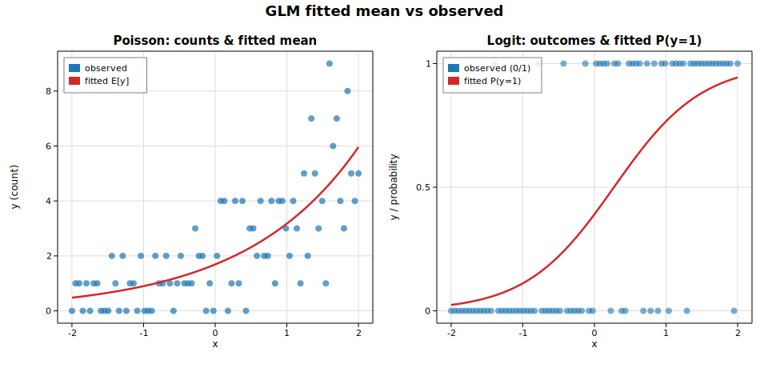

# Generalized linear models (Poisson & Logit)

Generalized linear models extend linear regression to non-Gaussian responses by
pairing an exponential-family error distribution with a link function that maps
the linear predictor onto the mean. Solow fits them by iteratively reweighted
least squares (IRLS). This example fits two of the most common GLMs:

* **Poisson** counts with the canonical **log** link: `log E[y] = β₀ + β₁x`.
* **Binomial** (Bernoulli) outcomes with the **logit** link:
  `logit P(y=1) = β₀ + β₁x`.

## Code

```rust
use ndarray::{Array1, Array2};
use solow_core::tools::{add_constant, HasConstant};
use solow_glm::{Family, Glm};

let n = 80usize;
let x_raw: Vec<f64> = (0..n).map(|i| -2.0 + 4.0 * i as f64 / (n - 1) as f64).collect();
let x = Array2::from_shape_vec((n, 1), x_raw.clone()).unwrap();
let design = add_constant(&x, true, HasConstant::Add).unwrap();

// Poisson: log mean = 0.4 + 0.7 x  (y_pois are Poisson draws)
let pois = Glm::new(Array1::from(y_pois), design.clone(), Family::Poisson)
    .unwrap().fit().unwrap();
println!("{}", pois.summary_titled("counts", Some(&["const", "x"])));

// Logit: logit P(y=1) = -0.3 + 1.6 x  (y_bin are Bernoulli draws)
let logit = Glm::new(Array1::from(y_bin), design.clone(), Family::Binomial)
    .unwrap().fit().unwrap();
println!("{}", logit.summary_titled("y", Some(&["const", "x"])));
```

The fitted mean curve is `exp(β₀ + β₁x)` for the Poisson model and the logistic
function `1 / (1 + exp(−(β₀ + β₁x)))` for the Logit model.

## Printed summary

```text
=== Poisson regression (log link) ===
                 Generalized Linear Model Regression Results
==============================================================================
Dep. Variable:                 counts   No. Observations:                   80
Model:                            GLM   Df Residuals:                       78
Model Family:                 Poisson   Df Model:                            1
Link Function:                    Log   Scale:                          1.0000
Method:                          IRLS   Log-Likelihood:                -123.65
No. Iterations:                     5   Deviance:                       75.380
==============================================================================
                 coef    std err          z      P>|z|      [0.025      0.975]
------------------------------------------------------------------------------
const          0.5244      0.096      5.484      0.000       0.337       0.712
x              0.6305      0.075      8.403      0.000       0.483       0.778
==============================================================================

=== Logistic regression (logit link) ===
                 Generalized Linear Model Regression Results
==============================================================================
Dep. Variable:                      y   No. Observations:                   80
Model:                            GLM   Df Residuals:                       78
Model Family:                Binomial   Df Model:                            1
Link Function:                  Logit   Scale:                          1.0000
Method:                          IRLS   Log-Likelihood:                -34.892
No. Iterations:                     6   Deviance:                       69.783
==============================================================================
                 coef    std err          z      P>|z|      [0.025      0.975]
------------------------------------------------------------------------------
const         -0.4458      0.308     -1.449      0.147      -1.049       0.157
x              1.6326      0.344      4.745      0.000       0.958       2.307
==============================================================================
```

Both slope estimates (`0.63` for Poisson, `1.63` for Logit) recover the true
generating coefficients (`0.7` and `1.6`).

## Plot

The left panel shows Poisson counts with the fitted mean curve; the right panel
shows the binary outcomes with the fitted success-probability curve.


