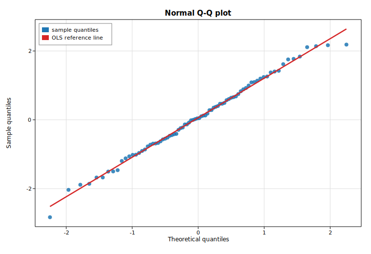

# Normal Q-Q plot (probability plot)

A normal quantile-quantile (Q-Q) plot compares the ordered values of a sample
against the quantiles you would expect from a standard normal distribution. If
the sample is approximately normal, the points fall close to a straight line.
This example draws a reproducible standard-normal sample, builds a
[`ProbPlot`](https://docs.rs/solow-graphics) from the `solow-graphics` crate,
prints the computed quantiles and the fitted reference line, and overlays an
ordinary-least-squares reference line on the scatter.

## Code

```rust
use solow_graphics::ProbPlot;
use solow_viz::{Color, Figure, LegendLoc, LineStyle, Marker};

// Reproducible sample: 80 draws from N(0, 1) via a deterministic SplitMix64 RNG.
let n = 80usize;
let data: Vec<f64> = (0..n).map(|_| rng.normal()).collect();

// Build the probability plot (standard-normal, Weibull plotting positions).
let pp = ProbPlot::new(&data);
let theo = pp.theoretical_quantiles(); // normal inverse-CDF of the plotting positions
let samp = pp.sample_quantiles();      // the sorted sample
let line = pp.qqline_regression();     // OLS of sample on theoretical quantiles

println!("No. observations:        {}", pp.nobs());
println!("regression (r): slope = {:.4}  intercept = {:.4}", line.slope, line.intercept);
```

The theoretical quantiles (x) and sample quantiles (y) are then scattered, with
the OLS reference line drawn across the quantile range:

```rust
let theo_v: Vec<f64> = theo.to_vec();
let samp_v: Vec<f64> = samp.to_vec();
let (lo, hi) = (theo_v[0], theo_v[theo_v.len() - 1]);
let ys_line = [line.slope * lo + line.intercept, line.slope * hi + line.intercept];

let mut fig = Figure::new(760, 520);
let ax = fig.axes();
ax.set_title("Normal Q-Q plot")
    .set_xlabel("Theoretical quantiles")
    .set_ylabel("Sample quantiles")
    .set_grid(true);
ax.scatter_full(&theo_v, &samp_v, Color::cycle(0), 4.0, Marker::Circle, 0.85,
                Some("sample quantiles"));
ax.line(&[lo, hi], &ys_line, Color::RED, 2.5, LineStyle::Solid, Marker::None, 1.0,
        Some("OLS reference line"));
ax.legend(LegendLoc::UpperLeft);
fig.save_svg("graphics_qq.svg").unwrap();
```

## Printed output

```text
Normal Q-Q plot (ProbPlot)
==========================
No. observations:        80
Theoretical quantiles:   [-2.2462, ..., 2.2462]
Sample quantiles:        [-2.8317, ..., 2.1851]

Reference lines (y = slope * x + intercept):
  regression (r):  slope = 1.1484   intercept = 0.0601
  standardized (s): slope = 1.0977   intercept = 0.0601
  quartile (q):    slope = 1.1361   intercept = 0.0767
```

The three reference lines agree closely (slopes near `1.1`, intercepts near
`0.06`), reflecting an approximately normal sample. The regression line `r` is
the least-squares fit of the sample on the theoretical quantiles; the
standardized line `s` uses the sample mean and standard deviation; and the
quartile line `q` passes through the first and third sample quartiles. The
slightly-above-one slope and the low-end sample quantile (`-2.83`) show this
particular draw has marginally heavier tails than the ideal normal.

## Plot


