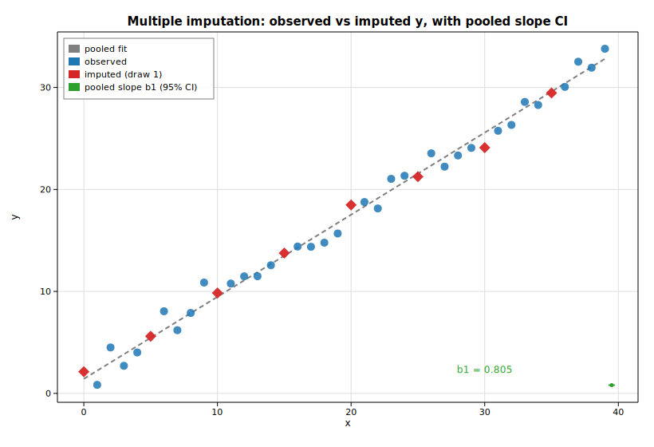

# Multiple imputation (MICE)

Multiple imputation handles missing data by filling each gap several times,
analysing every completed data set, and pooling the results so that the extra
uncertainty from the imputation is carried into the final inference. The
`solow-impute` crate implements the two *deterministic* pieces of this workflow:
[`conditional_mean_impute`](https://docs.rs/solow-impute) fits a regression on
the observed rows and predicts the conditional mean at the missing rows, and
[`combine`](https://docs.rs/solow-impute) applies Rubin's rules to pool the
per-imputation estimates.

This example builds `y = 1.5 + 0.8x + ε`, deletes every fifth `y` value, runs
`m = 20` imputations, refits each completed data set by OLS, and pools the slope
with Rubin's rules. The stochastic residual draw that turns the single
conditional mean into a proper imputation is supplied by the gallery's
deterministic RNG, so the whole run is reproducible.

## Code

```rust
use ndarray::{Array1, Array2};
use solow_impute::{combine, conditional_mean_impute};
use solow_regression::LinearModel;

// Complete data y = 1.5 + 0.8 x + N(0, 1), x = 0, 1, ..., 39, then delete
// every fifth y (MCAR). `observed` / `missing` index the two row blocks.
let endog_obs = Array1::from(observed.iter().map(|&i| y_full[i]).collect::<Vec<_>>());
let exog_obs  = /* [1, x] design over the observed rows  */;
let exog_miss = /* [1, x] design over the missing  rows  */;

// One deterministic conditional-mean fit; `scale` is the residual variance.
let imp = conditional_mean_impute(endog_obs, exog_obs, &exog_miss).unwrap();
let resid_sd = imp.scale.sqrt();

// m imputations: conditional mean + one residual-scale draw per missing cell,
// then refit the completed data set and collect (params, cov_params).
let mut params_list: Vec<Array1<f64>> = Vec::new();
let mut cov_list: Vec<Array2<f64>> = Vec::new();
for _ in 0..20 {
    let mut y = y_full.clone();
    for (k, &i) in missing.iter().enumerate() {
        y[i] = imp.imputed_missing[k] + resid_sd * rng.normal();
    }
    let res = LinearModel::ols(Array1::from(y), design_full.clone())
        .unwrap()
        .fit()
        .unwrap();
    params_list.push(res.params.clone());
    cov_list.push(res.cov_params.clone());
}

// Pool with Rubin's rules; dfcom is the observed-fit residual df.
let pooled = combine(&params_list, &cov_list, dfcom).unwrap();
let ci = pooled.conf_int(0.05);
```

The pooled slope is then drawn as a point-with-error-bar (its 95% CI) alongside
the observed and imputed `(x, y)` points and the pooled regression line:

```rust
let slope = pooled.params[1];
let half = (ci[[1, 1]] - ci[[1, 0]]) / 2.0;
ax.scatter_full(&x_obs, &y_obs, Color::BLUE, 5.0, Marker::Circle, 0.85, Some("observed"));
ax.scatter_full(&x_mis, &imputed_first, Color::RED, 7.0, Marker::Diamond, 0.95, Some("imputed (draw 1)"));
ax.errorbar(&[x_hi + 0.5], &[slope], &[half], Color::GREEN, Some("pooled slope b1 (95% CI)"));
fig.save_svg("mice_convergence.svg").unwrap();
```

## Printed results

```text
conditional-mean imputation
  fit on 32 observed rows: y_hat = 1.3950 + 0.8057 x   (residual sd = 0.9751)
  8 missing rows imputed at their conditional means:
    row  0: x =  0.0   y_imputed =  1.3950
    row  5: x =  5.0   y_imputed =  5.4236
    row 10: x = 10.0   y_imputed =  9.4523
    row 15: x = 15.0   y_imputed = 13.4809
    row 20: x = 20.0   y_imputed = 17.5096
    row 25: x = 25.0   y_imputed = 21.5382
    row 30: x = 30.0   y_imputed = 25.5668
    row 35: x = 35.0   y_imputed = 29.5955

pooled estimate over m = 20 imputations (Rubin's rules)
  param        coef    std err        fmi         df         95% conf. int.
  const      1.4215     0.3227     0.1245      24.19   [  0.7557,   2.0874]
  x          0.8050     0.0145     0.1517      23.23   [  0.7751,   0.8349]
```

The pooled slope `0.805` recovers the true `0.8` and the intercept `1.42` is
close to `1.5`; the 95% interval for the slope (`[0.775, 0.835]`) covers the
truth. The fraction of missing information (`fmi ≈ 0.12–0.15`) reflects the
8-of-40 deleted `y` values, and the Barnard–Rubin degrees of freedom (`≈ 23–24`)
are well below the complete-data df, the price multiple imputation pays for the
gaps.

## Plot


