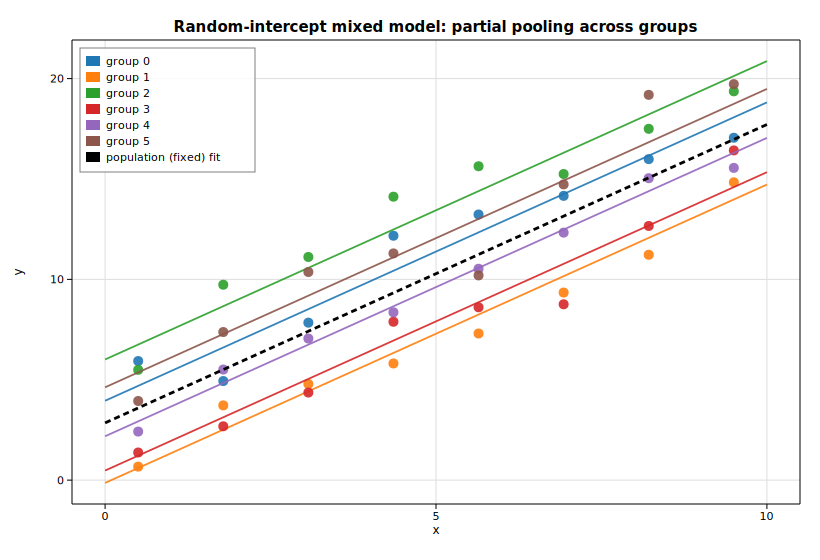

# Linear mixed effects (random intercepts)

A random-intercept mixed model fits `y = β₀ + β₁x + uₘ + ε`, where each group
`g` shares a single random intercept `uₘ ~ N(0, τ²)` on top of a common fixed
slope and intercept. This example simulates six groups of eight observations,
fits the model by REML with [`MixedLm`](https://docs.rs/solow-mixed), prints the
fixed effects and variance components, and draws each group's fitted line. The
group intercepts are *shrunk* toward the population line — the partial pooling
that distinguishes a mixed model from fitting each group on its own.

## Code

```rust
use ndarray::{Array1, Array2};
use solow_mixed::{MixedLm, RemlMethod};
use solow_viz::{Color, Figure, LegendLoc, LineStyle, Marker};

// True model: y = 3 + 1.5 x + u_g + e, with u_g ~ N(0, 2^2), e ~ N(0, 1.1^2).
// Six groups, eight observations each; x spread across [0.5, 9.5].
let n_groups = 6usize;
let per_group = 8usize;
// group_intercepts[g] is drawn once per group and reused within it;
// x_raw / y_raw / group_labels are built from deterministic pseudo-random noise.

let n = x_raw.len();
let mut exog = Array2::<f64>::ones((n, 2)); // intercept column + covariate x
for i in 0..n {
    exog[[i, 1]] = x_raw[i];
}
let endog = Array1::from(y_raw.clone());

// Fit the random-intercept model by REML.
let res = MixedLm::new(endog, exog, &group_labels)
    .unwrap()
    .method(RemlMethod::Reml)
    .fit()
    .unwrap();

let (b0_hat, b1_hat) = (res.fe_params[0], res.fe_params[1]);
```

The random intercepts are the best linear unbiased predictions (BLUPs), which
shrink each group's mean residual toward zero by `(nₘ·ψ)/(1 + nₘ·ψ)`:

```rust
let psi = res.psi;
let blup: Vec<f64> = (0..n_groups)
    .map(|g| {
        let ng = group_count[g] as f64;
        let mean_r = group_mean_resid[g] / ng; // mean of (y - X*beta) over group g
        (ng * psi) / (1.0 + ng * psi) * mean_r
    })
    .collect();
```

Each group is then drawn as a colored scatter with its own fitted line
(`intercept = b0_hat + blup[g]`, shared slope `b1_hat`), and the dashed black
line shows the population (fixed-effect-only) fit:

```rust
let mut fig = Figure::new(820, 560);
let ax = fig.axes();
ax.set_title("Random-intercept mixed model: partial pooling across groups")
    .set_xlabel("x").set_ylabel("y").set_grid(true);
for g in 0..n_groups {
    let color = Color::cycle(g);
    ax.scatter_full(&xs, &ys, color, 5.0, Marker::Circle, 0.9, Some(&format!("group {g}")));
    let intercept_g = b0_hat + blup[g];
    ax.line(&[0.0, 10.0], &[intercept_g, intercept_g + b1_hat * 10.0],
            color, 1.8, LineStyle::Solid, Marker::None, 0.9, None);
}
ax.line(&[0.0, 10.0], &[b0_hat, b0_hat + b1_hat * 10.0],
        Color::BLACK, 2.8, LineStyle::Dashed, Marker::None, 1.0, Some("population (fixed) fit"));
ax.legend(LegendLoc::UpperLeft);
fig.save_svg("docs/book/src/examples/img/mixed_ranef.svg").unwrap();
```

## Printed results

```text
Mixed Linear Model (random intercept), REML
================================================
No. Observations: 48
No. Groups:       6
Group size:       8 (balanced)

Fixed effects:
  const   coef=  2.8520   std err= 1.0529   z=  2.709
  x       coef=  1.4861   std err= 0.0556   z= 26.752

Variance components:
  Group Var (cov_re) = 6.0283
  Residual Var (scale) = 1.2855
  psi = cov_re/scale   = 4.6894
  REML log-likelihood  = -85.1268

Predicted random intercepts (BLUP, shrunk toward 0):
  group 0:  raw mean resid =  1.1312   BLUP u_g =  1.1018
  group 1:  raw mean resid = -3.0704   BLUP u_g = -2.9907
  group 2:  raw mean resid =  3.2425   BLUP u_g =  3.1583
  group 3:  raw mean resid = -2.4382   BLUP u_g = -2.3749
  group 4:  raw mean resid = -0.6845   BLUP u_g = -0.6668
  group 5:  raw mean resid =  1.8195   BLUP u_g =  1.7722
```

The recovered slope (`1.486`) and intercept (`2.852`) sit close to the true
`1.5` and `3.0`. The group variance (`6.03`) dominates the residual variance
(`1.29`), so `ψ ≈ 4.69` is large and each group's BLUP is shrunk only slightly
from its raw mean residual — when groups are this well-separated, partial
pooling stays close to the unpooled per-group fit.

## Plot


