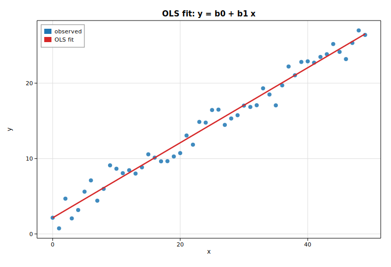

# Ordinary least squares (OLS)

Ordinary least squares fits the linear model `y = β₀ + β₁x + ε` by minimizing
the sum of squared residuals. This example synthesizes a noisy line, fits it
with [`LinearModel::ols`](https://docs.rs/solow-regression), prints the full
canonical results summary, and overlays the fitted line on the data.

## Code

```rust
use ndarray::{Array1, Array2};
use solow_core::tools::{add_constant, HasConstant};
use solow_regression::LinearModel;
use solow_viz::{Color, Figure, LegendLoc, LineStyle, Marker};

// Example data: y = 2 + 0.5 x + N(0, 1.2), x = 0, 1, ..., 49
let n = 50usize;
let x_raw: Vec<f64> = (0..n).map(|i| i as f64).collect();
// y_vec is built from x_raw plus deterministic pseudo-random noise.

let x = Array2::from_shape_vec((n, 1), x_raw.clone()).unwrap();
let y = Array1::from(y_vec.clone());

// Add an intercept column, then fit by ordinary least squares.
let design = add_constant(&x, true, HasConstant::Add).unwrap();
let res = LinearModel::ols(y, design).unwrap().fit().unwrap();

println!("{}", res.summary_titled("y", "OLS", Some(&["const", "x"])));
```

The fitted line is then drawn over the scatter:

```rust
let (b0, b1) = (res.params[0], res.params[1]);
let mut fig = Figure::new(760, 520);
let ax = fig.axes();
ax.set_title("OLS fit: y = b0 + b1 x").set_xlabel("x").set_ylabel("y").set_grid(true);
ax.scatter_full(&x_raw, &y_vec, Color::cycle(0), 4.0, Marker::Circle, 0.85, Some("observed"));
ax.line(&[0.0, (n - 1) as f64], &[b0, b0 + b1 * (n - 1) as f64],
        Color::RED, 2.5, LineStyle::Solid, Marker::None, 1.0, Some("OLS fit"));
ax.legend(LegendLoc::UpperLeft);
fig.save_svg("ols.svg").unwrap();
```

## Printed summary

```text
                            OLS Regression Results
==============================================================================
Dep. Variable:                       y   R-squared:                     0.976
Model:                             OLS   Adj. R-squared:                0.975
Method:                  Least Squares   F-statistic:                    1924
Date:                 Thu, 18 Jun 2026   Prob (F-statistic):         2.17e-40
Time:                         01:01:18   Log-Likelihood:              -77.253
No. Observations:                    50   AIC:                           158.5
Df Residuals:                       48   BIC:                           162.3
Df Model:                            1
Covariance Type:             nonrobust
==============================================================================
                   coef    std err         t     P>|t|      [0.025      0.975]
------------------------------------------------------------------------------
const            2.1421      0.323     6.640     0.000       1.493       2.791
x                0.4977      0.011    43.864     0.000       0.475       0.521
==============================================================================
Omnibus:                         1.459   Durbin-Watson:                 1.712
Prob(Omnibus):                   0.482   Jarque-Bera (JB):              1.079
Skew:                            0.048   Prob(JB):                      0.583
Kurtosis:                        2.287   Cond. No.                       56.1
==============================================================================

Notes:
[1] Standard Errors assume that the covariance matrix of the errors is correctly specified.
```

The recovered slope (`0.498`) and intercept (`2.142`) are close to the true
`0.5` and `2.0`, and `R² = 0.976` reflects the tight fit.

## Plot


