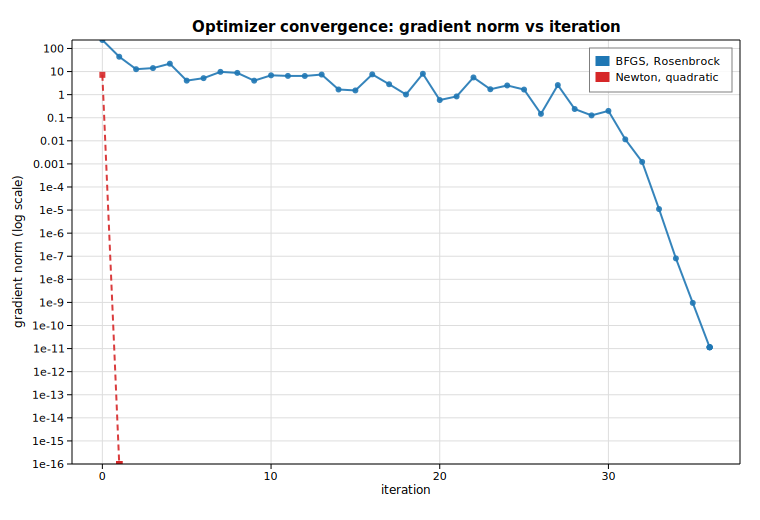

# Optimizer convergence

The optimizers in [`solow-optimize`](https://docs.rs/solow-optimize) *minimize* an
objective by driving its gradient to zero. This example runs two of them on
standard test functions and plots how fast each one converges:

- the **Rosenbrock** banana, minimized with
  [`minimize_bfgs`](https://docs.rs/solow-optimize) (gradient only — supplied
  here by central finite differences via
  [`approx_fprime`](https://docs.rs/solow-optimize));
- a convex **quadratic**, minimized with
  [`newton_stationary`](https://docs.rs/solow-optimize) (analytic gradient and
  Hessian).

Neither solver exposes a per-iteration trace, so the convergence curve is built
honestly: each solver is re-run from the same start with an increasing iteration
cap `k = 0, 1, 2, …`, and the final gradient norm reported by the returned
`OptimizeResult` is recorded at each cap. On a log y-scale the convergence
*rate* becomes a slope — BFGS descends steadily, while Newton lands on the
quadratic's minimum in a single step.

## Code

```rust
use ndarray::{array, Array1, Array2};
use solow_optimize::{approx_fprime, minimize_bfgs, newton_stationary};
use solow_viz::{Color, Figure, LegendLoc, LineStyle, Marker, Scale};

// Rosenbrock f(x) = (1 - x0)^2 + 100 (x1 - x0^2)^2, global min 0 at (1, 1).
fn rosenbrock(x: &Array1<f64>) -> f64 {
    (1.0 - x[0]).powi(2) + 100.0 * (x[1] - x[0] * x[0]).powi(2)
}

// Curve 1: BFGS on Rosenbrock, gradient from finite differences.
let start_rb = array![-1.2, 1.0];
let gtol = 1e-10;
let mut rb_iter: Vec<f64> = Vec::new();
let mut rb_gnorm: Vec<f64> = Vec::new();
for k in 0..=40 {
    let g = |x: &Array1<f64>| approx_fprime(x, rosenbrock);
    let r = minimize_bfgs(&start_rb, rosenbrock, g, k, gtol).unwrap();
    rb_iter.push(r.iters as f64);
    rb_gnorm.push(r.grad_norm.max(1e-16)); // floor for the log axis
}

// Curve 2: Newton on a convex quadratic, analytic g and H.
// f(x) = (x0 - 3)^2 + 2 (x1 + 1)^2, min 0 at (3, -1).
let fgh = |x: &Array1<f64>| {
    let f = (x[0] - 3.0).powi(2) + 2.0 * (x[1] + 1.0).powi(2);
    let g = array![2.0 * (x[0] - 3.0), 4.0 * (x[1] + 1.0)];
    let h: Array2<f64> = array![[2.0, 0.0], [0.0, 4.0]];
    (f, g, h)
};
let start_q = array![0.0, 0.0];
let mut q_iter: Vec<f64> = Vec::new();
let mut q_gnorm: Vec<f64> = Vec::new();
for k in 0..=6 {
    let r = newton_stationary(&start_q, fgh, k, gtol).unwrap();
    q_iter.push(r.iters as f64);
    q_gnorm.push(r.grad_norm.max(1e-16));
}
```

The two convergence curves are then drawn on a shared log y-scale:

```rust
let mut fig = Figure::new(760, 520);
let ax = fig.axes();
ax.set_title("Optimizer convergence: gradient norm vs iteration")
    .set_xlabel("iteration")
    .set_ylabel("gradient norm  (log scale)")
    .set_yscale(Scale::Log)
    .set_grid(true);
ax.line(&rb_iter, &rb_gnorm, Color::cycle(0), 2.0, LineStyle::Solid,
        Marker::Circle, 0.9, Some("BFGS, Rosenbrock"));
ax.line(&q_iter, &q_gnorm, Color::RED, 2.0, LineStyle::Dashed,
        Marker::Square, 0.9, Some("Newton, quadratic"));
ax.legend(LegendLoc::UpperRight);
fig.save_svg("optim_convergence.svg").unwrap();
```

## Printed results

```text
Optimizer convergence
=====================================================
BFGS on Rosenbrock  (start = [-1.2, 1.0])
  x* = [1.000000, 1.000000]
  f(x*)      = 6.410136e-19
  grad_norm  = 1.143454e-11
  iters      = 36
  converged  = true
-----------------------------------------------------
Newton on quadratic (start = [0.0, 0.0])
  x* = [3.000000, -1.000000]
  f(x*)      = 0.000000e0
  grad_norm  = 0.000000e0
  iters      = 1
  converged  = true
-----------------------------------------------------
Gradient norm vs iteration cap (BFGS / Rosenbrock):
  cap  0 -> iters  0  grad_norm = 2.3287e2
  cap  5 -> iters  5  grad_norm = 4.0462e0
  cap 10 -> iters 10  grad_norm = 6.8753e0
  cap 15 -> iters 15  grad_norm = 1.5209e0
  cap 20 -> iters 20  grad_norm = 5.8425e-1
  cap 25 -> iters 25  grad_norm = 1.6586e0
  cap 30 -> iters 30  grad_norm = 1.9769e-1
  cap 35 -> iters 35  grad_norm = 9.5186e-10
  cap 40 -> iters 36  grad_norm = 1.1435e-11
```

Newton reaches the quadratic's minimum `(3, -1)` exactly in one step, since the
Newton update is exact for a quadratic. BFGS needs 36 iterations to thread the
Rosenbrock valley but ends at `(1, 1)` with a gradient norm of `1.14e-11` — the
non-monotone early plateau (the gradient norm even rises around iteration 10 as
the iterate rounds the bend of the banana) gives way to a sharp final descent
once it reaches the smooth basin near the optimum.

## Plot


