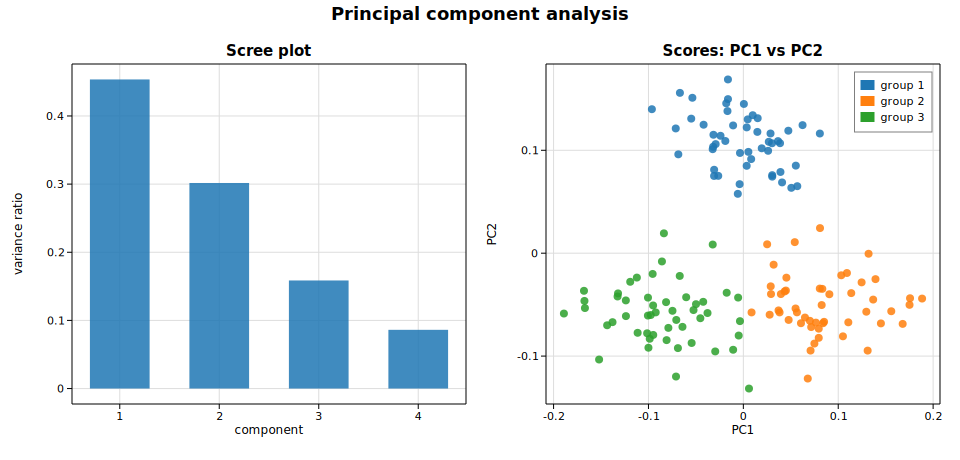

# Principal component analysis (PCA)

**Principal component analysis** finds an orthogonal basis ordered by the amount
of variance each direction captures. It is the standard tool for dimensionality
reduction and exploratory visualization. Solow provides it as
[`Pca`](https://docs.rs/solow-multivariate), with an optional standardization
step.

This example generates three clusters in a 4-dimensional feature space, fits PCA
on the standardized columns, and produces two classic diagnostics: a **scree
plot** of the per-component variance ratio and a **scores scatter** of the first
two principal components.

## Code

```rust
use ndarray::Array2;
use solow_multivariate::Pca;

// Three latent groups in 4-D; 50 points each.
let matrix = Array2::from_shape_vec((n, 4), data).unwrap();

// Fit on standardized columns.
let res = Pca::new(matrix).standardize(true).fit().unwrap();

// Results expose eigenvals, explained_variance_ratio, loadings, and scores.
for i in 0..res.ncomp {
    println!("comp {}: ratio = {:.4}", i + 1, res.explained_variance_ratio[i]);
}
// res.scores is nobs x ncomp; columns 0 and 1 are PC1 and PC2.
```

## Printed summary

```text
PCA on 150 observations x 4 variables
  comp    eigenvalue       var ratio      cumulative
     1      272.1529          0.4536          0.4536
     2      180.9883          0.3016          0.7552
     3       95.1618          0.1586          0.9138
     4       51.6970          0.0862          1.0000
```

The first two components together capture about 76% of the total variance — and,
as the scores plot shows, they are exactly the directions that separate the
three groups.

## Plot

Left: the scree plot (variance ratio per component). Right: the PC1/PC2 scores,
colored by the true group label — the three clusters are cleanly separated in
the leading two-component subspace.


