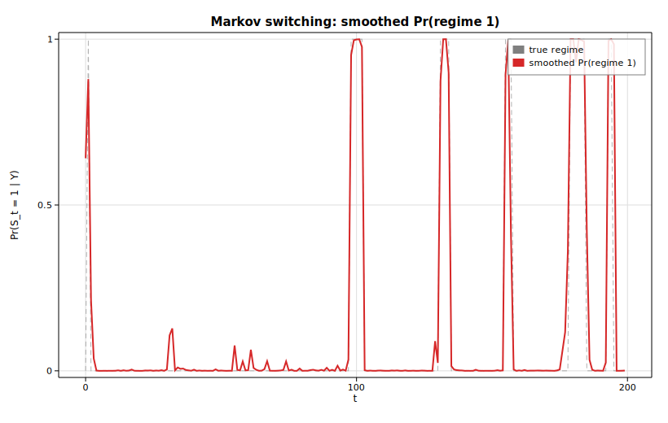

# Markov switching regime probabilities

A Markov-switching regression lets the mean (and, optionally, the variance) of a
series jump between a small number of unobserved *regimes*, with the regime
itself following a hidden first-order Markov chain. This example synthesizes a
series whose mean alternates between a low state and a high state, fits a
2-regime [`MarkovRegression`](https://docs.rs/solow-regime) by maximum
likelihood (the Hamilton filter, polished with the Kim smoother), prints the
fitted transition matrix and per-regime parameters, and plots the *smoothed*
probability of being in regime 1 over the whole sample — a 0..1 curve that says,
at each time `t`, how confidently the model places the observation in the
high-mean state given the entire series.

## Code

```rust
use ndarray::Array1;
use solow_regime::MarkovRegression;
use solow_viz::{Color, Figure, LegendLoc, LineStyle, Marker};

// A two-state hidden Markov chain drives the mean: regime 0 has mean 0,
// regime 1 has mean 4; both share noise std 1.0. The chain is persistent
// (stays put with probability 0.95), so the series shows clear stretches in
// each state. All noise comes from a deterministic SplitMix64 RNG.
let n = 200usize;
let mu = [0.0f64, 4.0f64];
let mut state = 0usize;
let mut y_vec = Vec::with_capacity(n);
for _ in 0..n {
    if rng.uniform() > 0.95 {
        state = 1 - state;
    }
    y_vec.push(mu[state] + rng.normal());
}
let y = Array1::from(y_vec);

// Fit a 2-regime switching regression (switching intercept and variance).
let model = MarkovRegression::new(y, 2, true).unwrap();
let res = model.fit().unwrap();

println!("log-likelihood : {:.4}", res.llf);
println!("transition     : {:?}", res.transition);
println!("durations      : {:?}", res.expected_durations);
```

The smoothed probability of regime 1 is column 1 of the `(nobs, k)`
`smoothed_marginal_probabilities` matrix, plotted against time:

```rust
let t_axis: Vec<f64> = (0..res.nobs).map(|t| t as f64).collect();
let p_regime1: Vec<f64> = (0..res.nobs)
    .map(|t| res.smoothed_marginal_probabilities[[t, 1]])
    .collect();

let mut fig = Figure::new(820, 520);
let ax = fig.axes();
ax.set_title("Markov switching: smoothed Pr(regime 1)")
    .set_xlabel("t").set_ylabel("Pr(S_t = 1 | Y)").set_grid(true);
ax.set_ylim(-0.02, 1.02);
ax.line(&t_axis, &p_regime1, Color::cycle(3), 2.0,
        LineStyle::Solid, Marker::None, 1.0, Some("smoothed Pr(regime 1)"));
ax.legend(LegendLoc::UpperRight);
fig.save_svg("regime.svg").unwrap();
```

## Printed output

```text
Markov switching regression (2 regimes)
  converged           : true
  nobs                : 200
  k_params            : 6
  log-likelihood      : -320.5637
  AIC                 : 653.1275
  BIC                 : 672.9174

  estimated parameters:
    p[0->0]      =    0.9634
    p[1->0]      =    0.2629
    const[0]     =    0.1902
    const[1]     =    3.1995
    sigma2[0]    =    1.0201
    sigma2[1]    =    1.2898

  transition matrix P[i<-j] (columns sum to 1):
    [0.9634, 0.2629]
    [0.0366, 0.7371]
  steady-state probs  : [0.8778, 0.1222]
  expected durations  : [27.33, 3.80] periods

  mean smoothed Pr(regime 1) : 0.1175
```

The estimator recovers two well-separated states: regime 0 has intercept
`0.19` and regime 1 has intercept `3.20`, close to the true means of `0` and `4`
(the regime labels are only identified up to relabelling, so the high-mean state
landed on regime 1). The fitted variances are near the true `1.0`. The
persistent low state has an expected duration of about `27` periods versus `3.8`
for the high state, and the steady-state distribution spends roughly `88%` of
the time in regime 0.

## Plot

The smoothed curve snaps close to 0 or 1 over most of the sample — the model is
usually confident about which regime generated each observation — with brief
ramps at the regime boundaries. The dashed grey line is the true hidden state
for comparison.


