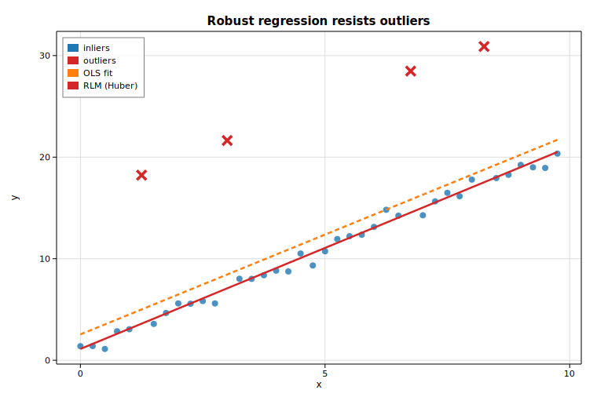

# Robust regression (RLM)

Ordinary least squares minimizes squared residuals, so a handful of gross
outliers can dominate the fit. **Robust linear models** replace the squared loss
with a bounded influence function (an M-estimator) that downweights observations
with large residuals. Solow's [`Rlm`](https://docs.rs/solow-robust) supports
several norms; here we use **Huber's T**.

This example contaminates clean linear data with four large vertical outliers
and contrasts OLS with the robust fit.

## Code

```rust
use ndarray::{Array1, Array2};
use solow_core::tools::{add_constant, HasConstant};
use solow_regression::LinearModel;
use solow_robust::norms::HuberT;
use solow_robust::Rlm;

let n = 40usize;
// Clean data y = 1 + 2 x + noise, then four points get +14 added.
let x = Array2::from_shape_vec((n, 1), x_raw.clone()).unwrap();
let y = Array1::from(y_vec.clone());
let design = add_constant(&x, true, HasConstant::Add).unwrap();

let ols = LinearModel::ols(y.clone(), design.clone()).unwrap().fit().unwrap();
let rlm = Rlm::new(y.clone(), design.clone(), HuberT::default())
    .unwrap().fit().unwrap();
```

`RlmResults` exposes `params`, `bse`, `tvalues`, `pvalues`, the robust `scale`
estimate, the IRLS `weights`, and convergence info.

## Printed summary

```text
Robust linear model (RLM) with Huber's T norm
True coefficients:  const = 1.000   x = 2.000

                             const           x
OLS params                  2.5459      1.9657
RLM params (Huber)          1.1171      1.9890
RLM std err                 0.2127      0.0375
RLM z-value                 5.2527     52.9831
RLM P>|z|                   0.0000      0.0000

Robust scale estimate: 0.5244   iterations: 15   converged: true
OLS is dragged toward the 4 outliers; RLM stays on the true line.
```

The OLS intercept is pulled up to `2.55` by the outliers, while the robust
estimate of `1.12` stays near the true value of `1.0`. The slope is barely
affected because the outliers are vertical.

## Plot

Outliers are marked with crosses. The dashed OLS line is tugged upward; the
solid robust line stays on the underlying relationship.


