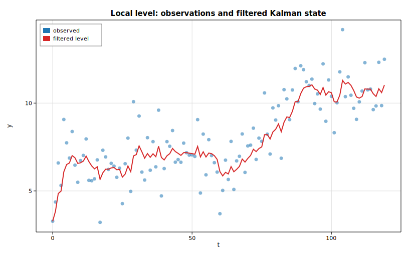

# State space: the Kalman filter

A **local-level** model treats an observed series as a random-walk level seen
through measurement noise:

```text
mu_t = mu_{t-1} + xi_t,    xi_t  ~ N(0, sigma2_level)
y_t  = mu_t     + eps_t,   eps_t ~ N(0, sigma2_irregular)
```

This example simulates such a series, fits an
[`UnobservedComponents`](https://docs.rs/solow-statespace) model by maximum
likelihood, runs the exact Kalman [`filter`](https://docs.rs/solow-statespace)
at the estimated variances, and overlays the filtered (one-step-ahead) level
estimate on the noisy observations. The two variances are recovered by
maximizing the exact Gaussian log-likelihood; the filter then returns the
filtered state means `a_{t|t}`.

## Code

```rust
use ndarray::Array1;
use solow_statespace::{Level, UcSpec, UnobservedComponents};
use solow_viz::{Color, Figure, LegendLoc, LineStyle, Marker};

// Simulate a local level: mu_t = mu_{t-1} + xi_t, y_t = mu_t + eps_t,
// with xi_t ~ N(0, 0.30) and eps_t ~ N(0, 1.50). All noise is the
// deterministic SplitMix64 RNG, so the example is fully reproducible.
let n = 120usize;
let sig_level = 0.30_f64.sqrt();
let sig_irreg = 1.50_f64.sqrt();

let mut mu = 5.0_f64;
let mut y_vec = Vec::with_capacity(n);
for _ in 0..n {
    mu += sig_level * rng.normal();
    y_vec.push(mu + sig_irreg * rng.normal());
}
let y = Array1::from(y_vec.clone());

// Fit the local-level model by maximum likelihood.
let spec = UcSpec::new(Level::LocalLevel);
let model = UnobservedComponents::new(y.clone(), spec).unwrap();
let res = model.fit().unwrap();

// params = [sigma2.irregular, sigma2.level] for a local level.
println!("sigma2.irregular = {:.6}", res.params[0]);
println!("sigma2.level     = {:.6}", res.params[1]);
println!("log-likelihood   = {:.6}", res.llf);

// Run the Kalman filter at the estimated variances. The first `burn`
// (= number of nonstationary states = 1) observation is excluded from the
// log-likelihood. The local level is the single state (column 0).
let ss = model.build_state_space(&res.params);
let out = ss.filter(&y, 1);
let filtered: Vec<f64> = out.filtered_state.column(0).to_vec();
```

The observations and the filtered level are then plotted together:

```rust
let t: Vec<f64> = (0..n).map(|i| i as f64).collect();
let mut fig = Figure::new(820, 520);
let ax = fig.axes();
ax.set_title("Local level: observations and filtered Kalman state")
    .set_xlabel("t").set_ylabel("y").set_grid(true);
ax.scatter_full(&t, &y_vec, Color::cycle(0), 3.5, Marker::Circle, 0.55, Some("observed"));
ax.line(&t, &filtered, Color::RED, 2.0, LineStyle::Solid, Marker::None, 1.0, Some("filtered level"));
ax.legend(LegendLoc::UpperLeft);
fig.save_svg("state_space.svg").unwrap();
```

## Printed output

```text
Local-level unobserved-components fit (Kalman filter MLE)
  nobs            = 120
  converged       = true
  sigma2.irregular= 1.613496  (true 1.500000)
  sigma2.level    = 0.106240  (true 0.300000)
  log-likelihood  = -213.002320
  AIC             = 430.004640
  BIC             = 435.579624
  HQIC            = 432.268667
  MSE(filtered vs true level) = 0.449815
  MSE(observed vs true level) = 1.414496
  first filtered states: 3.2756, 3.8404, 4.8522
```

The estimated irregular variance (`1.613`) is close to the simulated `1.500`,
while the level variance is pulled toward the lower end of the flat likelihood
ridge that is typical of unobserved-components models. What matters in practice
is the filtered state: it tracks the unobserved true level far more closely than
the raw series does — mean squared error `0.450` versus `1.414` — exactly the
noise reduction the Kalman filter is designed to deliver.

## Plot


