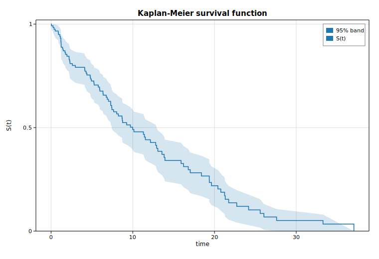

# Survival analysis (Kaplan-Meier)

The **Kaplan-Meier** estimator is the workhorse of survival analysis: a
non-parametric, product-limit estimate of the survival function `S(t) =
P(T > t)` from right-censored time-to-event data. Solow provides it as
[`SurvfuncRight`](https://docs.rs/solow-duration).

This example generates exponential event times with independent exponential
censoring, estimates `S(t)`, and plots it as a step function with Greenwood
pointwise 95% confidence bands.

## Code

```rust
use solow_duration::SurvfuncRight;
use solow_viz::{Color, Figure, LineStyle, StepWhere};

// Right-censored data: event ~ Exp(0.08), censoring ~ Exp(0.03).
// time[i] = min(event, censor); status[i] = 1 if the event was observed, else 0.
let km = SurvfuncRight::new(&time, &status).unwrap();

// The estimate exposes parallel arrays over the distinct event times:
//   surv_times, surv_prob, surv_prob_se (Greenwood), n_risk, n_events.
for i in 0..km.surv_times.len() {
    println!("{:.3}  S={:.4}", km.surv_times[i], km.surv_prob[i]);
}
```

The plot prepends `(t=0, S=1)` so the curve starts at the origin, then shades a
band of `S ± 1.96 · SE` using `fill_between` and draws the survival curve with a
`step` (post) line:

```rust
let mut fig = Figure::new(760, 520);
let ax = fig.axes();
ax.set_title("Kaplan-Meier survival function").set_xlabel("time").set_ylabel("S(t)");
ax.set_ylim(0.0, 1.02);
ax.fill_between(&t, &lo, &hi, Color::cycle(0), 0.18, Some("95% band"));
ax.step(&t, &s, Color::cycle(0), StepWhere::Post, Some("S(t)"));
fig.save_svg("survival.svg").unwrap();
```

## Printed summary

```text
Kaplan-Meier survival estimate
Observations: 120   events: 85   distinct event times: 85

      time    n_risk   n_event        S(t)
     0.051       120         1      0.9917
     1.204       107         1      0.9232
     1.779        99         1      0.8535
     4.115        86         1      0.7819
     5.268        74         1      0.7057
     7.025        64         1      0.6268
     8.681        53         1      0.5456
    11.420        36         1      0.4543
    13.937        24         1      0.3411
    19.629        15         1      0.2192
    25.589         6         1      0.0854

Median survival ~ first time with S(t) <= 0.5: 9.986
```

The survival probability decays monotonically from 1, and the median survival
time (where `S(t)` first drops to 0.5) is about `10.0`, consistent with the
event rate of `0.08`.

## Plot


