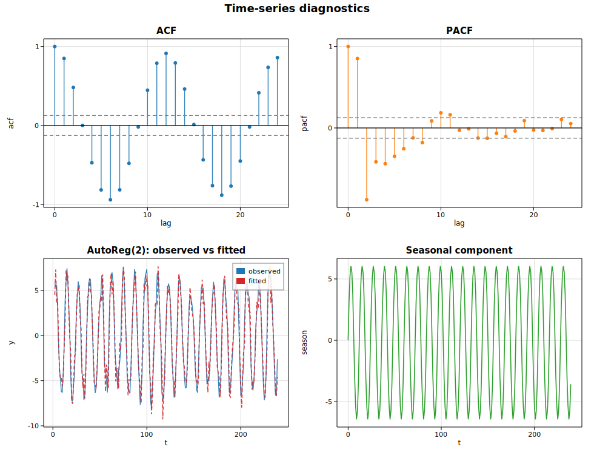

# Time series

This example exercises the core time-series toolkit on a single synthetic
series — a stationary AR(2) process with a 12-period seasonal cycle layered on
top:

* the sample **autocorrelation** (`acf`) and **partial autocorrelation**
  (`pacf`) functions, drawn as stem plots with approximate 95% significance
  bands at ±1.96/√n;
* an **autoregressive** model fit, [`AutoReg`](https://docs.rs/solow-tsa), whose
  estimated coefficients recover the generating dynamics;
* a classical additive **seasonal decomposition**, `seasonal_decompose`, into
  trend, seasonal, and residual components.

## Code

```rust
use ndarray::Array1;
use solow_tsa::{acf, pacf, seasonal_decompose, AutoReg, PacfMethod, SeasonalModel, Trend};

let series = Array1::from(y);  // AR(2) + seasonal + noise, n = 240

// ACF / PACF up to 24 lags, with a +/- 1.96/sqrt(n) band.
let nlags = 24;
let acf_vals = acf(&series, nlags, false).unwrap();
let pacf_vals = pacf(&series, nlags, PacfMethod::YuleWalker).unwrap();
let conf = 1.96 / (series.len() as f64).sqrt();

// Fit an AR(2) with a constant.
let ar = AutoReg::new(series.clone(), 2, Trend::C).unwrap().fit().unwrap();

// Additive decomposition at period 12.
let dec = seasonal_decompose(&series, 12, SeasonalModel::Additive).unwrap();
```

## Printed summary

```text
Sample ACF (lags 0..5): [1.0, 0.849, 0.481, 0.001, -0.471, -0.815]
Sample PACF (lags 0..5): [1.0, 0.852, -0.882, -0.416, -0.438, -0.348]
Approx 95% band: +/- 0.1265

AutoReg(2) with constant trend
param                 coef     std err           z       P>|z|
const               0.0091      0.0792      0.1146      0.9088
y.L1                1.5844      0.0326     48.5305      0.0000
y.L2               -0.8668      0.0328    -26.4401      0.0000
sigma2 = 1.4929   llf = -385.389   aic = 778.778   bic = 792.667   nobs = 238

Additive decomposition: period = 12, finite trend points = 228
```

The PACF cutting off sharply after lag 2 is the classic signature of an AR(2)
process, and the fitted AR coefficients are both highly significant.

## Plot

Four panels: the ACF and PACF stem plots (with significance bands), the AR(2)
observed-versus-fitted overlay, and the extracted seasonal component.


