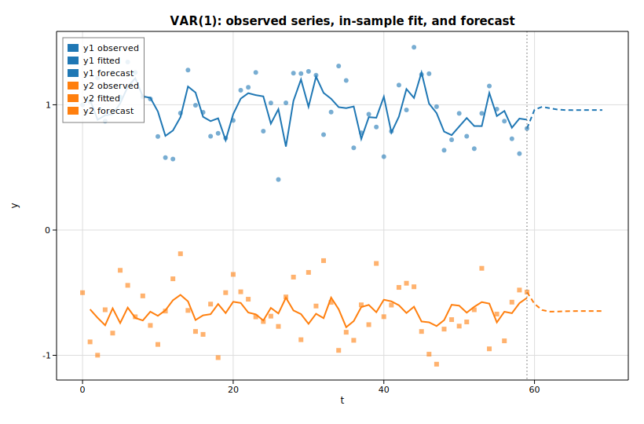

# Vector autoregression (VAR)

A vector autoregression models several time series jointly, letting each
variable depend on the recent past of every variable in the system. For a
`K`-dimensional series and lag order `p`, the VAR(`p`) is

```text
y_t = ν + A₁ y_{t-1} + … + A_p y_{t-p} + u_t
```

This example simulates a stable bivariate VAR(1) with a deterministic noise
stream, fits a VAR(1) with [`Var`](https://docs.rs/solow-var) by
equation-by-equation OLS, prints the estimated intercept, coefficient matrix,
residual covariance, log-likelihood and information criteria, and then plots the
two observed series with their in-sample fitted values and a short forecast
iterated from the estimated parameters.

## Code

```rust
use ndarray::Array2;
use solow_var::Var;
use solow_viz::{Color, Figure, LegendLoc, LineStyle, Marker};

// Simulate a stable bivariate VAR(1): y_t = nu + A y_{t-1} + u_t.
// Noise is a deterministic pseudo-random stream, so the run is reproducible.
let n = 60usize;
let nu = [0.6_f64, -0.3_f64];
let a = [[0.5_f64, 0.2_f64], [-0.1_f64, 0.4_f64]];

let mut y = Array2::<f64>::zeros((n, 2));
y[[0, 0]] = 1.0;
y[[0, 1]] = -0.5;
for t in 1..n {
    let (y0, y1) = (y[[t - 1, 0]], y[[t - 1, 1]]);
    y[[t, 0]] = nu[0] + a[0][0] * y0 + a[0][1] * y1 + 0.20 * noise();
    y[[t, 1]] = nu[1] + a[1][0] * y0 + a[1][1] * y1 + 0.20 * noise();
}

// Fit a VAR(1) by equation-by-equation OLS.
let res = Var::new(y.clone()).unwrap().fit(1).unwrap();

println!("intercept nu    = [{:.4}, {:.4}]", res.intercept[0], res.intercept[1]);
let a_hat = &res.coefs[0];           // estimated A_1 (K x K)
println!("log-likelihood  = {:.4}", res.llf);
println!("AIC = {:.4}   BIC = {:.4}   HQIC = {:.4}", res.aic, res.bic, res.hqic);
```

The forecast is iterated directly from the fitted parameters, seeded at the last
observation:

```rust
// y_hat_{T+h} = nu_hat + A_hat * y_hat_{T+h-1}
let h = 10usize;
let mut fc = Array2::<f64>::zeros((h, 2));
let mut prev = [y[[n - 1, 0]], y[[n - 1, 1]]];
for k in 0..h {
    let f0 = res.intercept[0] + a_hat[[0, 0]] * prev[0] + a_hat[[0, 1]] * prev[1];
    let f1 = res.intercept[1] + a_hat[[1, 0]] * prev[0] + a_hat[[1, 1]] * prev[1];
    fc[[k, 0]] = f0;
    fc[[k, 1]] = f1;
    prev = [f0, f1];
}
```

Each series is then drawn three ways — observed points, the in-sample fitted
line (`res.fittedvalues`, which covers observations `p..n`), and the dashed
forecast extension:

```rust
let mut fig = Figure::new(820, 540);
let ax = fig.axes();
ax.set_title("VAR(1): observed series, in-sample fit, and forecast")
    .set_xlabel("t").set_ylabel("y").set_grid(true);
ax.scatter_full(&t_obs, &y0_obs, Color::cycle(0), 3.0, Marker::Circle, 0.6, Some("y1 observed"));
ax.line(&t_fit, &y0_fit, Color::cycle(0), 2.0, LineStyle::Solid, Marker::None, 1.0, Some("y1 fitted"));
ax.line(&t_fc, &y0_fc, Color::cycle(0), 2.0, LineStyle::Dashed, Marker::None, 1.0, Some("y1 forecast"));
// ... y2 drawn the same way with Color::cycle(1) ...
ax.axvline((n - 1) as f64, Color::GRAY, LineStyle::Dotted);
ax.legend(LegendLoc::UpperLeft);
fig.save_svg("var_forecast.svg").unwrap();
```

## Printed output

```text
VAR(1) fit on a simulated bivariate system
neqs (K)        = 2
k_ar (p)        = 1
nobs (T)        = 59
df_model        = 3
df_resid        = 56

intercept nu    = [0.8260, -0.3279]   (true [0.6, -0.3])
estimated A_1   =
  [  0.4305    0.4334]   (true [ 0.5   0.2])
  [ -0.2270    0.1568]   (true [-0.1   0.4])

sigma_u (resid cov, df-adjusted) =
  [  0.04121   -0.00061]
  [ -0.00061    0.04326]

log-likelihood  = 22.3775
AIC = -6.2309   BIC = -6.0196   HQIC = -6.1485   FPE = 0.001968

forecast horizon h = 10
y_hat[T+1]      = [0.9603, -0.5894]
y_hat[T+10]     = [0.9581, -0.6467]
```

With `T = 59` usable observations and a 20% noise scale, the estimated intercept
and `A₁` recover the broad structure of the true parameters but are pulled
around by sampling noise (most visibly the off-diagonal terms). The residual
covariance `sigma_u` is close to the `0.20² = 0.04` innovation variance used in
the simulation, and the forecast settles toward the process mean as the
horizon grows.

## Plot


