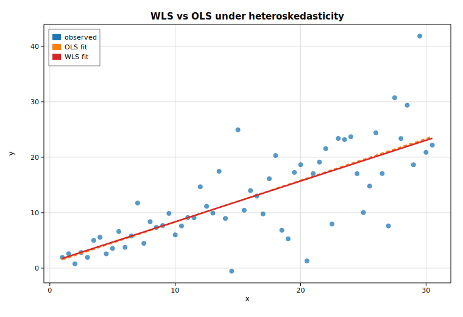

# Weighted & generalized least squares (WLS / GLS)

When the error variance is not constant across observations
(heteroskedasticity), ordinary least squares stays unbiased but is no longer
efficient, and its standard errors are wrong. **Weighted least squares** fixes
this by weighting each observation by the inverse of its error variance.
**Generalized least squares** is the general form: supply the full error
covariance matrix `Σ`. With a *diagonal* `Σ`, GLS reduces exactly to WLS.

This example builds data whose noise standard deviation grows with `x`, then
fits OLS, WLS, and GLS for comparison.

## Code

```rust
use ndarray::{Array1, Array2};
use solow_core::tools::{add_constant, HasConstant};
use solow_regression::LinearModel;

// Heteroskedastic data: the noise sd scales with x, so later points are noisier.
let n = 60usize;
let x_raw: Vec<f64> = (0..n).map(|i| 1.0 + i as f64 * 0.5).collect();
let sd: Vec<f64> = x_raw.iter().map(|&xi| 0.35 * xi).collect();
// y_vec = 1 + 0.8 x + sd * noise

let x = Array2::from_shape_vec((n, 1), x_raw.clone()).unwrap();
let y = Array1::from(y_vec.clone());
let design = add_constant(&x, true, HasConstant::Add).unwrap();

// Weights proportional to 1 / variance; Sigma is the diagonal variance matrix.
let weights = Array1::from(sd.iter().map(|&s| 1.0 / (s * s)).collect::<Vec<_>>());
let mut sigma = Array2::<f64>::zeros((n, n));
for i in 0..n { sigma[[i, i]] = sd[i] * sd[i]; }

let ols = LinearModel::ols(y.clone(), design.clone()).unwrap().fit().unwrap();
let wls = LinearModel::wls(y.clone(), design.clone(), weights).unwrap().fit().unwrap();
let gls = LinearModel::gls(y.clone(), design.clone(), &sigma).unwrap().fit().unwrap();
```

## Printed summary

OLS treats every point as equally informative:

```text
                            OLS Regression Results
==============================================================================
Dep. Variable:                       y   R-squared:                     0.565
Model:                             OLS   Adj. R-squared:                0.558
No. Observations:                    60   F-statistic:                   75.47
==============================================================================
                   coef    std err         t     P>|t|      [0.025      0.975]
------------------------------------------------------------------------------
const            0.7950      1.555     0.511     0.611      -2.317       3.907
x                0.7514      0.086     8.687     0.000       0.578       0.925
==============================================================================
```

WLS downweights the noisy high-`x` points, tightening the standard errors:

```text
                            WLS Regression Results
==============================================================================
Dep. Variable:                       y   R-squared:                     0.743
Model:                             WLS   Adj. R-squared:                0.739
No. Observations:                    60   F-statistic:                   167.8
==============================================================================
                   coef    std err         t     P>|t|      [0.025      0.975]
------------------------------------------------------------------------------
const            1.0254      0.277     3.703     0.000       0.471       1.580
x                0.7345      0.057    12.955     0.000       0.621       0.848
==============================================================================
```

The WLS intercept standard error drops from `1.555` to `0.277`. And GLS with a
diagonal `Σ` reproduces the WLS coefficients to the bit:

```text
GLS with diagonal Sigma reproduces the WLS coefficients exactly:
  WLS params = [1.025374, 0.734467]
  GLS params = [1.025374, 0.734467]
```

## Plot

The dashed OLS line is tilted by the high-variance points; the solid WLS line
tracks the underlying relationship more faithfully.


